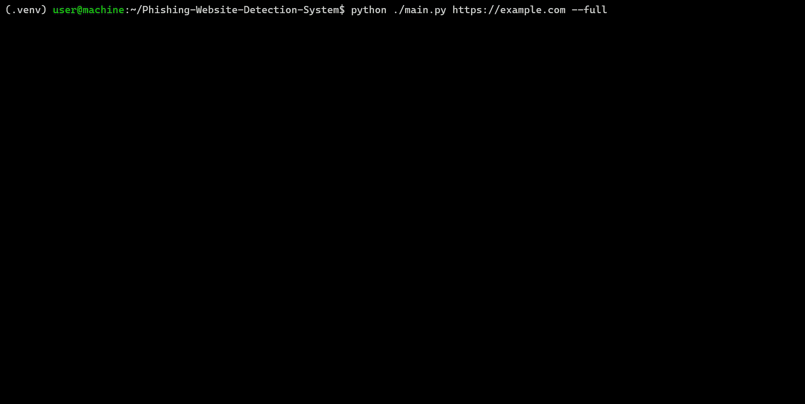

# URL Risk Analysis System

<details>
  <summary>Table of Contents</summary>
  <ol>
    <li>
      <a href="#about-the-project">About The Project</a>
      <ul>
        <li><a href="#built-with">Built With</a></li>
      </ul>
    </li>
    <li><a href="#attributions-to-datasets-used">Attributions to Datasets Used</a></li>
    <li><a href="#project-highlights">Project Highlights</a></li>
    <li>
      <a href="#dashboard">Dashboard</a>
      <ul>
        <li><a href="#dashboard-preview">Dashboard Preview</a></li>
        <li><a href="#features">Features</a></li>
      </ul>
    </li>
    <li>
      <a href="#command-line-interface">Command Line Interface</a>
      <ul>
        <li><a href="#cli-preview">CLI Interface Preview</a></li>
        <li><a href="#features-1">Features</a></li>
      </ul>
    </li>
    <li><a href="#architecture">Architecture</a></li>
    <li>
      <a href="#getting-started">Getting Started</a>
      <ul>
        <li><a href="#prerequisites">Prerequisites</a></li>
        <li><a href="#installation">Installation</a></li>
        <li><a href="#usage">Usage</a></li>
      </ul>
    </li>
  </ol>
</details>

## About the Project
***URL Risk Analysis System*** is a phishing website analysis platform consisting of an interactive machine learning dashboard and a command-line URL inspection tool. Users can explore phishing detection models, compare phishing and legitimate website characteristics, and perform detailed URL security analysis.

The tool aggregates low-level signals (e.g., domain age, mismatched links, hidden elements) into higher-level insights, helping users identify potentially unsafe or deceptive websites.

### Built With

- Programming Languages
    * [![Python][Python-icon]][Python-url]
    * [![JavaScript][JavaScript-icon]][JavaScript-url]
    * [![Jupyter][Jupyter-icon]][Jupyter-url]
    * [![CSS][CSS-icon]][CSS-url]

- Major Libraries
    * [![Dash][Dash-icon]][Dash-url]
    * [![Matplotlib][Matplotlib-icon]][Matplotlib-url]
    * [![Numpy][Numpy-icon]][Numpy-url]
    * [![Pandas][Pandas-icon]][Pandas-url]
    * [![Plotly][Plotly-icon]][Plotly-url]
    * [![Seaborn][Seaborn-icon]][Seaborn-url]
    * [![Scikit-Learn][Scikit-Learn-icon]][Scikit-Learn-url]


## Attributions to Datasets Used

This project utilizes the **Phishing Url** dataset by [Hemanth Pingali](https://www.kaggle.com/hemanthpingali),
obtained from [Kaggle](https://www.kaggle.com/) at https://www.kaggle.com/datasets/hemanthpingali/phishing-url.

The dataset is licensed under [**CC BY-NC-SA 4.0**](https://creativecommons.org/licenses/by-nc-sa/4.0/). No modifications were made to the original dataset. It is used for model training, evaluation, and feature analysis within this project.

For exploratory data analysis (EDA) and to understand the rationale behind feature removal decisions, see [dataset_overview.ipynb](docs/dataset_overview.ipynb).

## Project Highlights
- Built and evaluated multiple machine learning phishing detection models
- Interactive Dash/Plotly analytics dashboard
- Feature importance and explainable ML visualizations
- Statistical profiling of phishing and legitimate URLs
- Command-line URL risk assessment and inspection

## Dashboard
The dashboard enables users to explore model performance, visualize feature importance, compare phishing and legitimate URL characteristics, and better understand how machine learning models identify malicious websites. The dashboard is deployed and available at [https://url-risk-analysis-dashboard.onrender.com/](https://url-risk-analysis-dashboard.onrender.com/).

### Dashboard Preview


### Features
- 📈 Model Performance Metrics
    - Accuracy
    - Precision
    - Recall
    - F1-Score
    - ROC-AUC
- 📊 Feature Importance Analysis
    - Displays the most important predictive features used by the selected model
    - Updates automatically when a different model is selected
- 🆚 URL Profile Comparison
    - Compares characteristic phishing and legitimate URL patterns side-by-side
- 𖣠 Radar Chart
    - Compares phishing and legitimate URL profiles across the model's five most important features
    - Enables quick visual identification of distinguishing characteristics

## Command Line Interface
A detailed URL inspection tool that analyzes domain, certificate, transport, structural URL, and webpage characteristics to identify potential phishing indicators and provide explainable security insights.

### CLI Preview


### Features

- 🔍 Multi-layer URL inspection pipeline
- 🧠 Signal-based risk detection with rule-based reasoning
- 🔐 TLS and certificate validation
- 🌐 URL structure and obfuscation analysis
- 🎭 HTML/CSS behavior detection (hidden elements, overlays, deceptive links)
- 📖 Explainable outputs with human-readable security insights

## Architecture

The URL Risk Analysis System combines multiple analysis techniques and external intelligence sources to evaluate the risk associated with a URL. For a detailed overview of the system design, see [architecture.md](docs/architecture.md) for architecture diagrams created using [diagrams.net](https://app.diagrams.net/).

The architecture documentation includes:
- Network topology
- Risk analysis hierarchy
- Multi-stage evaluation pipeline
- Analysis methods and data sources

## Getting Started
If you're a developer and looking to contribute to the application yourself, follow the given steps.

### Prerequisites
Before installing the URL Risk Analysis System, ensure the following are available:
- Python 3.11 or later
- An active internet connection for retrieving DNS, WHOIS, reputation, and webpage data

### Installation
1. Clone/download a copy of this repository.
2. Open your terminal and navigate to the project folder.
3. Create a virtual environment within the folder by typing in `python -m venv venv` and pressing enter.

> [!NOTE]
> Confirm that the `venv/` folder was created using `dir` for Windows users or `ls` for Linux/macOs users.

5. Activate the environment

> [!NOTE]
> Windows users run `venv\Scripts\Activate` while those on Linux/macOS should run `source venv/bin/activate`.

6. Install the necessary packages into the environment  by running `pip install -r requirements.txt`.

> [!TIP]
> In addition to running the above command, developers looking to contribute should run: `pip install -r requirements-dev.txt`

7. Run either the dashboard or command line tool.

> [!NOTE]
> To utilize the "VirusTotal Malware Scan" feature, you will need to signup with [VirusTotal](https://www.virustotal.com/gui/join-us) in order to get an API key to interact with their API. Use of this feature will be permitted after inputting the line `API_KEY="{YOUR_API_KEY_FOR_VIRUSTOTAL}"` into a *.env* file at project root.

### Usage

#### Dashboard
1. Run `python -m app.generate_models`
2. Run `python -m utils.statistcal_profiling.py`
3. Run `python -m app.dashboard`.
4. Open [http://127.0.0.1:8050/](http://127.0.0.1:8050/) on your browser to view dashboard.

#### Command Line
- Run 
```bash
python ./main.py google.com
```
- Refer to [cli.md](docs/cli.md) for more examples and specific command instructions.

<!-- MARKDOWN LINKS & IMAGES -->
<!-- https://www.markdownguide.org/basic-syntax/#reference-style-links -->
[CSS-icon]: https://img.shields.io/badge/CSS-639?style=for-the-badge&logo=css&logoColor=fff
[CSS-url]: https://developer.mozilla.org/en-US/docs/Web/CSS
[JavaScript-icon]: https://img.shields.io/badge/JavaScript-F7DF1E?style=for-the-badge&logo=javascript&logoColor=000
[JavaScript-url]: https://developer.mozilla.org/en-US/docs/Web/JavaScript
[Jupyter-icon]: https://img.shields.io/badge/Jupyter-ffffff?style=for-the-badge&logo=Jupyter
[Jupyter-url]: https://jupyter.org/
[Python-icon]: https://img.shields.io/badge/Python-3776AB?style=for-the-badge&logo=python&logoColor=white
[Python-url]: https://www.python.org/

[Dash-icon]: https://img.shields.io/badge/Dash-008DE4?style=for-thee-badge&logo=plotly&logoColor=white
[Dash-url]: https://dash.plotly.com/
[Matplotlib-icon]: https://custom-icon-badges.demolab.com/badge/Matplotlib-71D291?logo=matplotlib&logoColor=fff
[Matplotlib-url]: https://matplotlib.org/
[Numpy-icon]: https://img.shields.io/badge/NumPy-4DABCF?logo=numpy&logoColor=fff
[Numpy-url]: https://numpy.org/
[Pandas-icon]: https://img.shields.io/badge/Pandas-150458?logo=pandas&logoColor=fff
[Pandas-url]: https://pandas.pydata.org/
[Plotly-icon]: https://img.shields.io/badge/Plotly-3F44F75?logo=plotly&logoColor=white
[Plotly-url]: https://plotly.com/python/
[Seaborn-icon]: https://img.shields.io/badge/Seaborn-4EAEAA?logo=python&logoColor=fff
[Seaborn-url]: https://seaborn.pydata.org/
[Scikit-Learn-icon]: https://img.shields.io/badge/-Scikit--Learn-%23F7931E?logo=scikit-learn&logoColor=white
[Scikit-Learn-url]: https://scikit-learn.org/stable/index.html
