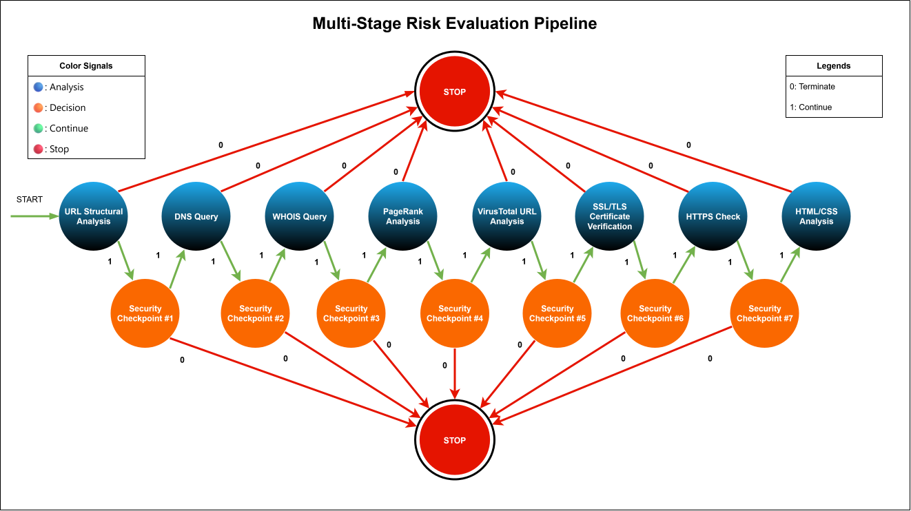

    <h1>Multi-Layer Analysis Pipeline</h1>

[← Go back to Documentation page](../README.md)

- The URL passes through a sequence of security checkpoints of a finite automata structure. Each stage contributes additional information used in the final risk assessment.

- Upon reaching each checkpoint, the system determines with its current knowledge of the target's risk indicators whether to proceed to the next stage of analysis or stop early. This risk-conscious architecture minimizes unnecessary interaction with potentially malicious websites while prioritizing safer, lower-risk intelligence gathering techniques whenever possible.

<!-- FooterStart -->
---
[02 Risk Analysis Hierarchy →](02_risk_analysis_order.md) | [04 Analysis Methods →](04_analysis_methods.md)
<!-- FooterEnd -->