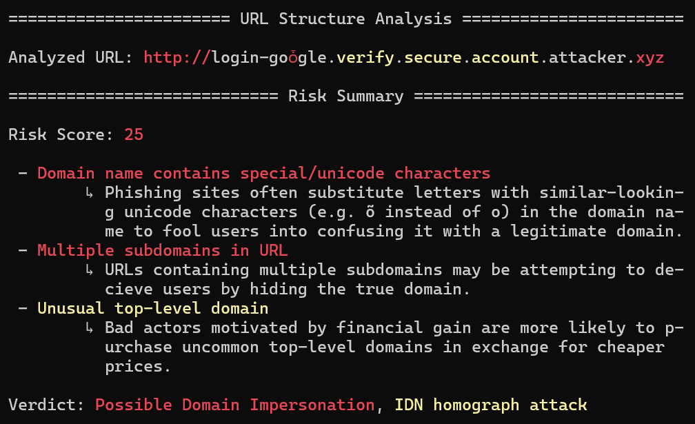
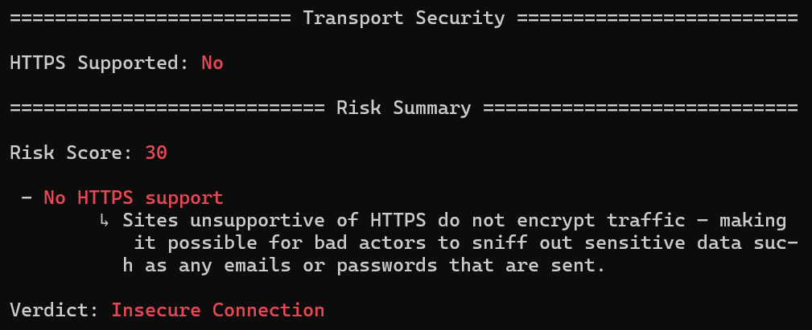
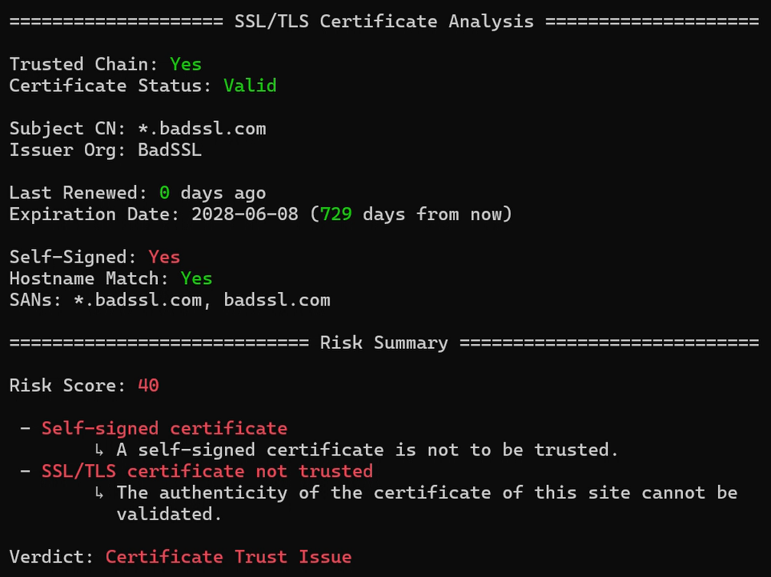

# Command Line Interface

> [!NOTE]
> All domains used in the following examples are safe, publicly documented, or reserved for testing purposes (e.g., example.com, badssl.com, neverssl.com).

## Arguments

### Usage:
```bash
python main.py <url> [options]
```

### Analysis Options
|Analysis            |Description                                               |
|--------------------|----------------------------------------------------------|
|domain_identity     |Performs Whois lookup for domain name registration details|
|url_structure       |Examines structural makeup of a URL                       |
|transport_security  |Performs HTTPS Check                                      |
|ssl, tls, cert      |Validates SSL/TLS certificate                             |
|html                |Examines HTML/CSS                                         |
|virustotal          |Performs VirusTotal lookup for malware                    |

### Mode Options
|Modes             |Description                                                                |
|------------------|---------------------------------------------------------------------------|
|default           |Runs safest configuration of analyses if no specific analysis is given     |
|passive           |Avoids direct contact to target site via a network connection              |
|offline, air_gap  |Runs only those analyses that require no network usage                     |
|full              |Runs all analyses

### Filter Options
|Filters    |Description                                   |
|-----------|----------------------------------------------|
|exclude    |Prevents the specified analyses from running  |

### Output Options
|Output             |Description                                         |
|-------------------|----------------------------------------------------|
|no_explanations    |Disables print out of explanations in risk summary  |
|no_summary         |Disables print out of risk summary                  |

## Commands and Outputs

### Legend

- ✅ <span style="color:#22c55e">GREEN</span> = Expected / secure component  
- ⚠️ <span style="color:#eab308">YELLOW</span> = Suspicious indicator  
- ❌ <span style="color:#ef4444">RED</span> = High-risk signal  

### Case #1: Default Scan
```bash
python ./main.py google.com
```


### Case #2: Full Analysis
```bash
python ./main.py https://example.com --full
```


### Case #3: Passive Analysis
```bash
python ./main.py example.net --domain_identity
```


### Case #4: Offline Analysis (w/ Spoofed URL)
```bash
# Intentionally spoofed URL for demonstration
python ./main.py http://login-goȱgle.verify.secure.account.attacker.xyz --url_structure
```


### Case #5: Transport Security Analysis
```bash
python ./main.py http://neverssl.com/ --transport_security
```


### Case #6: SSL/TLS Certificate Analysis (w/ Expired Certificate)
```bash
python ./main.py https://expired.badssl.com --cert
```


### Case #7: SSL/TLS Certificate Analysis (w/ Self-Signed Certificate)
```bash
python ./main.py https://self-signed.badssl.com/ --cert
```

